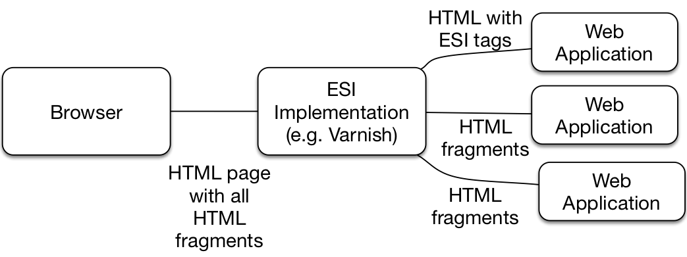
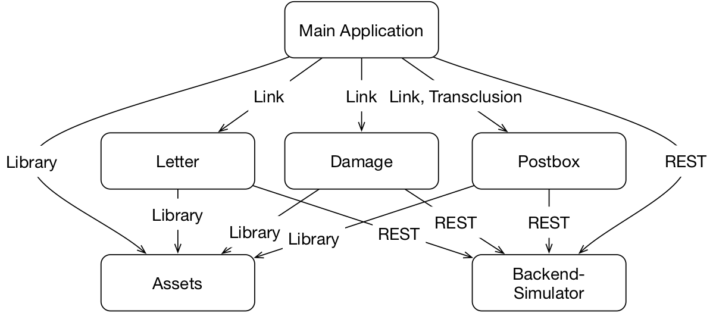

# Concept: Frontend Integration

Microservices can include a web frontend. Self-contained Systems even
must have a web frontend. Therefore, microservices can be integrated
at the frontend.

## Why Frontend Integration?

Frontend integration creates *loose coupling*. If links are used for the
integration, only the URL is known by the other system. What
is behind the URL and how the information is presented can be changed
without affecting the system that displays the URL in a link.

Another benefit of frontend integration is the *free choice of
front-end technologies*. Especially with front-end technologies, there
are lots of innovations. Constantly there are new JavaScript
frameworks and new ways to design attractive user interfaces (UIs). An
important advantage of microservices is the freedom of
technology. Every microservice can choose its own technologies. If
technology freedom should also apply to the frontend, then every
microservice must contain its own frontend, potentially using a
different frontend technology.  For this, the frontends of the
microservices must be integrated so that the frontends appear to be
part of a single system.

Thanks to frontend integration, *all functionality* for a domain is
implemented *in a single microservice*. For example, a microservice
might be responsible for displaying received messages even if the
display of the messages is integrated in the UI of another
microservice. If more information, such as a priority of the message
should be displayed, the changes to the logic, the data management and
the presentation can be implemented by changing only one microservice
even if another microservice displays that information in its UI.

## Recipe: ESI (Edge Side Includes)

[ESI](https://www.w3.org/TR/esi-lang) (Edge Side Includes) integrates
HTML fragments of a microservice with fragments of other
microservices.  For this, the microservice generates HTML, which
contains ESI tags. The ESI implementation evaluates the ESI tags and
includes HTML fragments of others microservices.

ESI is mainly implemented by caches. By splitting the HTML pages,
static fragments can be cached even if they are integrated into a
dynamic website. CDNs (Content Delivery Networks) can also implement
ESI. CDNs are actually used to deliver static HTML pages and
images. For this CDNs operate server nodes on the Internet, allowing
pages and images to loaded from a server nearby for every user and
reducing the load times.  With ESI, the CDNs can at least cache
fragments of dynamic pages.

So, ESI composes an HTML page from several HTML fragments, which can
be supplied by various microservices.

An example of an ESI integration is available at
<https://github.com/ewolff/SCS-ESI>. There is also [guide how to run
the example](https://github.com/ewolff/SCS-ESI/blob/master/HOW-TO-RUN.md).

In the example, ESI integration is used to integrate fragments of a
common microservices into the web pages of other microservices. The
example contains only one implemented microservice, the order
microservice. The order microservice is a Spring Boot application and
written in Java while the common microservice is written in Go. It
shows that even very different technologies can be integrated in the
frontend.

{title = "Listing 1: HTML output by the Order Microservice", id = "listing-01"}
~~~~~~~~
<html>
<head>
...
  <esi:include src="/common/header"></esi:include>
</head>

<body>
  

    <esi:include src="/common/navbar"></esi:include>
    ...
  

  <esi:include src="/common/footer"></esi:include>
</body>
</html>
~~~~~~~~

The Order Microservice returns an HTML page as shown in
[listing 1](#listing-01). Such a page is available at
<http://localhost: 8090/> when the Docker container runs on the local 
computer. If you look at this page in the browser, the browser does
not interpret the ESI tags, so the browser displays a garbled web
page.

The example uses the web cache [Varnish](https://varnish-cache.org/)
as an ESI implementation. The common microservice provides the
content for the ESI tags. The Varnish runs at
<http://localhost:8080/> when the Docker container runs on the
local computer. [Listing 2](#listing-02) shows the HTML that
Varnish returns.

{title = "Listing 2: Varnish's HTML output", id = "listing-02"}
~~~~~~~~
<html>
<head>
...
  <link rel="stylesheet"
   href="/common/bootstrap-3.3.7/bootstrap.css" />
  <link rel="stylesheet"
   href="/common/bootstrap-3.3.7/bootstrap-theme.css" />
</head>

<body>
  

    <a class="brand"
     href="https://github.com/ultraq/thymeleaf-layout-dialect">
     Thymeleaf - Layout </a>
    Mon Sep 18 2017 17:52:01 

    ...
  

  <script
   src="/common/bootstrap-3.3.7/bootstrap.js" />
</body>
</html>
~~~~~~~~

As you can see, the common microservice adds headers and footers as
well a navigation bar. The common microservice also implements a kind
of asset server: it makes shared libraries like Bootstrap available.

If a new version of Bootstrap should be used, only the HTML fragment
in the common microservice must be changed and the new bootstrap
version must be provided by the common microservice.  However, in a
productive system this is hardly enough because the user interface
of the order microservice needs to be tested with the new Bootstrap
version.

#### Caching and Resilience

Because the system uses a Varnish cache, the HTML fragments are cached
for 30 seconds. That can be seen by looking at the time in the
navigation bar, which changes only every 30 seconds. If one of the
microservices fails, the time for caching is even extended to 15
minutes. The configuration for Varnish can be found in the file
`default.vcl` in the directory `docker/varnish/` in the example.

So the Varnish cache improves not just the performance of the system
but also the resilience because the system still works at least for 15
minutes even if the microservices fail.

With server-side integration the whole HTML page with all fragments is
always send to the client. In the example, in fact all fragments of
the page need to be present: Without the frame and the Bootstrap
library the page is not really usable. An optional information such as
the number of items in the shopping cart does not necessarily have to
be integrated with ESI.

#### Alternative: Server-Side Includes (SSI)

Another option for server-side frontend integration is
[SSI](https://en.wikipedia.org/wiki/Server_Side_Includes) (Server-side
Includes). This is a feature that most web servers provide.  So for
the integration the Varnish cache is replaced by a web server. This
has the advantage that a web server may already be installed for
example for TLS / SSL termination. In that case, the additional effort
for server-side integration is much lower because no additional
software needs to be installed.  However, the advantages of the cache
concerning performance and resilience are
lost. <https://scs-commerce.github.io/> is an example of a system that
uses SSI with nginx for frontend integration.

## Alternative Recipes: Links and JavaScript

The Crimson Assurance example uses a completely different approach to
frontend integration.  The example was created as a prototype for a
German insurance to show how a web application with front-end
integration can be implemented. The two INNOQ consultants Lucas Dohmen
and Marc Jansing have implemented this example.

This example is available on the
[Internet](https://crimson-portal.herokuapp.com/).  You can run the
example on your own laptop as a set of Docker containers provided by a
[project on Github](https://github.com/ewolff/crimson-assurance-demo),
too.  A
[guide](https://github.com/ewolff/crimson-assurance-demo/blob/master/HOW-TO-RUN.md)
explains how to run the example.

This example implements an application for a clerk an insurance. The
main application `crimson-portal` has links to the applications for
writing letters `crimson-letter`, for reporting damage
`crimson-damage` and the REST backend simulator
`crimson-backend`. These links use parameters to pass information like
the contract ID to the other applications.

Only for the integration of the postbox an additional client-side
integration is implemented in about 50 lines of JavaScript.
So the postbox can also be included in the main page of the portal.

All of the applications have a consistent look & Feel that is
supported through shared assets in the project `crimson-styleguide`.
The assets are integrated into the projects as a library during the
build.

This example shows how far you can get with a simple integration with
links. In addition, this example also shows the integration of very
different systems: the main application, letter and damage are
implemented with NodeJS, while the postbox is implemented with Java
and Spring Boot.

Another example of client-side integration is
<https://github.com/ewolff/SCS-jQuery>. It implements a very simple
client-side integration with JavaScript implemented. From a user
perspective the example is identical with the ESI example.

Both projects use links. The linked pages will be transcluded into the
original page through JavaScript. Even if the JavaScript can not be
executed because there is an error in the code or the linked page is
not available, the system still works: It just displays a link instead
of the messages in the postbox.

Because client-side integration is implemented in jQuery in both
examples, each system must integrate this JavaScript library in a
version that works with that integration. This leads to a restriction
of the technology freedom. An implementation with pure JavaScript
would be better in this regard.

## Conclusion

Front-end integration leads to a very loose coupling. In many cases,
links are enough. Then the systems only need to know the URLs of the
linked pages. If a web page is to be composed of fragments from
different systems, then the necessary integration can take place on
the server. With a cache ESI can be used. The cache allows HTML
fragments to be cached. That benefits performance and resilience. Web
servers can implement SSI. If a web server is already in use, then the
additional infrastructure of a cache can be saved. Finally, a
client-side integration can load optional content, such as the
overview of the postbox.

## Wxperiments

* Start the ESI example. Please refer to
<https://github.com/ewolff/SCS-ESI/blob/master/HOW-TO-RUN.md>.

* Look at the output of the Varnish cache at <http://localhost:8080/>
and compare it to the output of the   order microservice at
<http://localhost:8090/>. Take a look   at the source code of the
returned HTML pages with your   Browser. How can you access the HTML
fragments of the common microservice?

* Try the user interface. Stop the microservices with `docker-compose
up --scale common=0` or `docker-compose up --scale order=0`. Which
microservices are still usable?

