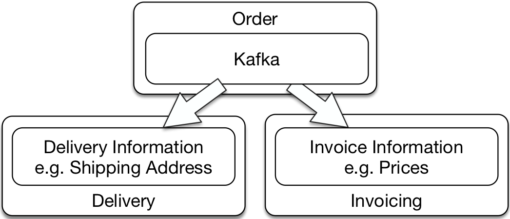

# Concept: Asynchronous Microservices

Microservices can exchange messages. Asynchronous
communication allows loose coupling and good resilience.

## Definition

Asynchronous microservices differ from synchronous microservices. The
next chapter describes synchronous microservices in detail. The term
"synchronous microservices" means for the following:

> A microservice is synchronous if it makes a request to other
> microservices and waits for the result while it is processing
> requests.

Asynchronous microservices do not wait for responses from other
systems while they are processing a request themselves. There are two
ways to do this:

* The microservice does not communicate with other systems while
  processing a request. Then, the microservice will typically
  communicate with the other systems at a different time. For example,
  the microservice can replicate data that is used when processing a
  request. For example, customer data can be replicated in order to
  access the locally stored customer data when processing an order.

* The microservice sends a request to another microservice, but does
  not wait for an response. A microservice for processing an order can
  send a message to another microservice that creates the invoice. An
  response to this message is not necessary and therefore does not have
  to wait.

## Why Asynchronous Microservices?

Asynchronous microservices have several advantages:

* If a communication partner fails, the message is transmitted later
  when the communication partner is available again. So asynchronous
  communication *provides resilience*, i.e, a protection against the
  failure of parts of the system.

* The transmission and processing of a message can almost always be
  *guaranteed*: the messages are stored. At some point they will be
  processed. The fact that they are processed can for example be
  ensured by the recipient acknowledging the message.

* Asynchronous microservices can implement *events*. Events provide
  better decoupling. For example, an event could be "order
  received". Each microservice can decide for itself how it reacts to
  the event. For example, one microservice can create an invoice and
  another can initiate the delivery. If additional microservices are
  added e.g. for a bonus program, they only have to respond
  appropriately to the existing event. So the system is very easy to
  extend.

## Recipe: Messaging with Kafka

Kafka is an example of message-oriented middleware (MOM). A MOM sends
messages and ensures that the messages arrive at the recipient. MOMs
are asynchronous. So you do not implement a request / reply approach
as with synchronous communication protocols but only send messages.

#### Basic Kafka Concepts

[Kafka](https://kafka.apache.org/) differs from other MOMs mainly in
the fact that it permanently stores the messages it transmits instead
of discarding them after transmission.

The main concepts of Kafka are:

* There are three *APIs*: the *Producer API* for sending data, *the
  Consumer API* for receiving data and the   *Streams API* to
  transform the data.

* Kafka organizes data in *records*. They contain the transmitted as
  *value*. Also records have a *key* and a *timestamp*.

* *Topics* contains records. Usually records of a certain kind are
  sent as part of a topic.

* Topics are divided into *partitions*. When a producer creates a new
  record, the record is appended to a partition of the topic. The
  distribution of records to partitions is implemented by the producer
  and usually based on the key of the record.

* Kafka stores the *offset* for each consumer in each partition. This
 offset indicates which record the consumer last read in the
 partition. If a consumer has processed a record, the consumer can
 commit a new offset. For every consumer Kafka only needs to store the
 offset in each partition which is relatively lightweight.

* In a *consumer group* there is exactly one consumer for each
  partition. This ensures that a record is processed by one
  consumer: The record is stored in a partition, which is
  processed by one consumer thanks to the consumer group.

* *Log compaction* is a mechanism that can be used to delete old records:
  If there are multiple records with the same ID, a log compaction
  deletes all these records except the last one. This can be used to
  remove events that are superseded by newer events.

Kafka can be operated in a cluster to provide reliability and scalability.

#### The Kafka Example

The example can be found on
[GitHub](https://github.com/ewolff/microservice-kafka). The
[guide](https://github.com/ewolff/microservice-kafka/blob/master/HOW-TO-RUN.md)
contains an extensive documentation that explains the installation and
starting the example step by step.

If the Docker containers run on the local machine, the web application
is available at <http://localhost:8080/>. The web interface is served
by an Apache httpd web server acting as a reverse proxy. It forwards
the HTTP requests to the microservices.

#### Split of the Example into Microservices

The system consists of a microservice `order`, which accepts orders
via the web interface. The order microservice then sends the order
data as a record via Kafka to the `shipping` microservice and the
`invoicing` microservice. The order is transferred as JSON. Because of
JSON's flexibility, the invoicing microservice and the shipping
microservice can read just the data that is relevant for the
respective microservice from the JSON data structure.

All shipping microservice instances and all invoicing microservice
instances are each organized in a consumer group. This means that the
records for the orders are load balanced over all consumers, but each
record is sent to just one consumer. This ensures that only one
invoicing microservice writes an invoice for an order and only one
shipping microservice delivers the goods.

The shipping microservice and the invoicing microservice store the
information from the records in their own database schemas. All
microservices use the same Postgres database.

Each Kafka record contains an order. The key is the ID of the order
with the suffix `created`, for example` 1created`.

#### Avro: An Alternative Data Format

An alternative data format is [Avro](http://avro.apache.org/). It
 provides a binary protocol but also a JSON representation. Avro can
 define a schema for the data.  It is also possible, for example with
 default values, to convert data from an old version of the schema to
 a new version of the schema. This allows old events to be processed
 even if the schema has changed in the meantime.

## Alternative Recipe: REST with Atom

Asynchronous microservices can also be implemented with REST. For
example, it is possible to provide orders as an [Atom Feed]
https://validator.w3.org/feed/docs/atom.html). Atom is a data format
originally developed to make blogs available to readers. Just as a new
entry in an Atom document is created for each new blog post, the same
is possible for every new order. A client must then periodically poll
the Atom document and process new entries. That's not very
efficient. It can be optimized by HTTP caching. Then data will only be
transferred if there are really new entries. Pagination can also
ensure that only the most recent entries are transmitted, not all.

An example of an asynchronous integration of microservices with Atom
can be found at
<https://github.com/ewolff/microservice-atom>. <https://github.com/ewolff/microservice-atom/blob/master/HOW-TO-RUN.md>
explains in detail the necessary steps to run the example.

Atom has the advantage of being based on REST and HTTP. As a result,
no MOM must be operated. In most cases, teams already have experiences
with HTTP and web servers. Thus, the operations can be ensured even
with large amounts of data.

Unfortunately, this type of communication can not ensure that an order
is only received and processed by a single microservice instance. If
one of the microservices instances in the example application read a
new order from the Atom feed, it first checks whether there is already
an entry for this order in the database, and then it only create an
entry itself if this is not the case. So only one entry in the
database is created for each order.

It is not mandatory to use the Atom format. You can also
use your own format to make the changes available as a list and then
provide details with links. Likewise, a different feed format such as
[RSS] (http://web.resource.org/rss/1.0/spec) or [JSON Feed]
(http://jsonfeed.org/) can be used.

#### Other MOMs

Of course, also other MOM than Kafka can be used. For example, there
are
[JMS implementations](https://en.wikipedia.org/wiki/Java_Message_Service#Provider_implementations),
the Java messaging service standard
([JMS](https://jcp.org/aboutJava/communityprocess/final/jsr914/index.html))
or
[implementations](https://en.wikipedia.org/wiki/Advanced_Message_Queuing_Protocol#Implementations)
of the [AMQP](https://www.amqp.org/) (Advanced Message Queuing
Protocol). But then the microservices have to deal with the fact that
old events will not be available after some time.

## Conclusion

Asynchronous microservices offer advantages in resilience but also in
decoupling. Kafka is an interesting alternative for asynchronous
microservices because the history of the events is stored
long-term. In addition, it can also support a large number of clients,
without consuming too many resources.

An HTTP / REST based system that offers changes as an Atom feed or in
a different data format has the advantage over Kafka that it does not
need an additional server. It is not that easy to send a message to a
single recipient, because the protocol does not have a direct support
for this.

## experiments

* Start the Kafka example. See
  <https://github.com/ewolff/microservice-kafka/blob/master/HOW-TO-RUN.md>.

* It is possible to start multiple instances of the shipping and
  invoicing microservice. This can be done with `docker-compose up -d
  --scale shipping=2` or` docker-compose up -d --scale
  invoicing=2`. With `docker logs mskafka_invoicing_2` you can look at
  the logs. In the logs he microservice indicates which Kafka
  partitions it is accepting records from..
