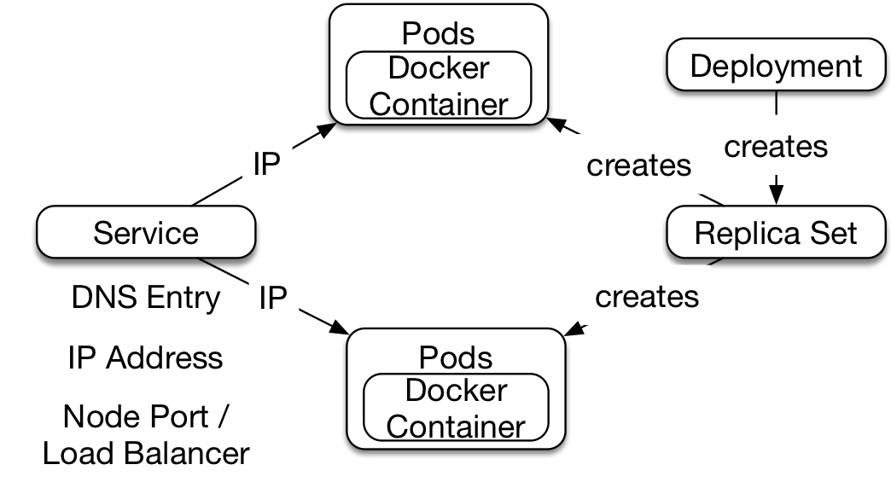

# Concept: Synchronous Microservices

Many microservice systems use synchronous communication. This chapter
shows how synchronous microservices can be implemented with different
technologies.

## Definition

The last chapter has already defined synchronous microservices:

> A microservice is syncronous if it makes a request to other
> microservices and waits for the result while itself processing requests.

So, a synchronous order microservice can request customer data from
another microservice while processing a request for an order.

Many microservice systems use synchronous communication. This chapter
shows how synchronous microservices can be implemented with different
technologies.

## Why Synchronous Microservices?

The reasons for using synchronous microservices are:

* Synchronous Microservices are *easy to understand*.
Instead of a local method call, functionality is called in another
microservice. This is quite close to what programmers are used to.

* Better *consistency* can be achieved. For each call the latest
  information is retrieved from all other services. So the data is
  up-to-date unless a last-minute change has occurred.

But *resilience * is more complex: If the called microservice is
currently not available, the caller must deal with the failure 9in a
way that it does not fail as well. For this, the caller can use data
from a cache or resort to a simplified algorithm that does not need
the information from the other microservice.

## Challenges

For synchronous communication some challenges have to be solved:

* A microservice typically provides its interface via TCP / IP at a
  specific IP address and port. The caller must get this information.
  *Service discovery* solves this challenge.

* For each microservice, multiple instances can run. *Load balancing*
  must distribute the calls to all instances.

* To external users all microservices should be perceived as part of a
 system and be available under one URL. *Routing* ensures that calls
 are forwarded to the correct microservice.

* As already mentioned, *resilience* presents a particular challenge
  that must also be addressed.

A technology for implementing synchronous microservices must provide a
solution to each of these challenges.

## Recipe: Kubernetes

[Kubernetes](https://kubernetes.io/) is becoming increasingly
important as the environment for the development and operations of
microservices.

#### Docker

Kubernetes is based on [Docker](https://www.docker.com/). Docker
makes it possible to decouple processes from each other in a Linux
system: *Docker containers* provide an operating system process with
its own file system and its own network interface with its own IP
address. Unlike a virtual machine, however, all Docker containers use
the same Linux kernel. So a Docker container is consumes hardly more
ressources than a Linux process. It is easily possible to run hundreds
of Docker containers on a laptop.

File systems in Docker containers are based on *Docker images*. The images
contain all the files that the Docker container needs. This can
include a Linux distribution or a Java runtime
environment. Docker images have layers. The Linux distribution can be
one layer and the Java runtime environment another. All Java
microservices can share these two layers. These layers are stored
only once on the Docker host. This significantly reduces the storage
space occupied by Docker images.

#### Kubernetes is a Docker Scheduler.

Running Docker containers on a single Docker host is not enough. If
the Docker host fails, all Docker containers will fail. In addition,
the scalability is limited by the performance of the Docker host.

To run Docker containers in a cluster of machines, there are
schedulers like *Kubernetes*. Kubernetes introduces some new concepts:

* *Nodes* are the servers Kubernetes is running on. They are organized
  in a cluster.

* *Pods* are multiple Docker containers that provide a servive
  together. This could be, for example, a container with a
  microservice together with a container for log processing.

* A *replica set* ensures that there is always a certain number of
  instances running for each pod.

* A *deployment* creates a replica set and provides the required
  Docker images.

* *Services* make pods accessible. The services are registered under a
name in the DNS and have a fixed IP address under which they can be
contacted throughout the cluster. In addition, the service enables the
routing of request from the outside to a service instance.

The figures shows all the Kubernetes concept: A deployment
creates a replica set. The replica Set does not just create the
Kubernetes pods, but also launches new, in case some of the pods
fail. The pods include one or more docker containers.

The Kubernetes service creates the DNS record and makes the
microservice available at an IP address that is unique throughout the
cluster. Finally, the server creates a *node port*. Under this port
the service can be reached on all Kubernetes nodes. Instead of a node
port, a service can also create a *load balancer*. This is a load
balancer offered by the infrastructure. For example, if Kubernetes is
running in the Amazon Cloud, Kubernetes would create an Amazon Elastic
Load Balancer.

#### Synchronous Microservices with Kubernetes

Kubernetes solves the challenges of synchronous microservices as follows:

* For *service discovery* Kubernetes uses DNS. The Kubernetes service
  sets up the corresponding DNS entry. Other microservices can then
  access the service by its host name.

* Kubernetes implements *load balancing* at the IP level. The
   Kubernetes service has an IP address. Behind the scenes, traffic to
   the IP address is load balanced across all service instances.

* Concerning *routing* the Kubernetes service can be implemented
  either via the node port or via a load balancer. It depends on how
  the service is configured and if the infrastructure offers a load
  balancer. An external request is either be sent to the load
  balancer or the node port to reach the microservice.

* For *resilience* Kubernetes has no solution. Of course, Kubernetes
  can start additional pods in case of a failure, but further
  resilience patterns like timeout or circuit breaker are not
  implemented by Kubernetes.

The solution that Kubernetes offers for the challenges of synchronous
microservices does not lead to any code dependencies on Kubernetes. If
a microservice invokes another, it must resolve the name using DNS and
communicate with the returned IP address. This is no different from
communicating with any other server. For routing, an external
system uses a port on a Kubernetes host or a load balancer. Even in
this case, it is transparent that Kubernetes is at work behind the
scenes.

#### The example with Kubernetes

The example is available on
[GitHub](https://github.com/ewolff/microservice-kubernetes). A
[guide](https://github.com/ewolff/microservice-kubernetes/HOW-TO-RUN.md)
explains in detail the necessary steps to install the software and run
the example.

The example consists of three microservices: order, customer and
catalog. Order uses catalog and customer via the REST interface. In
addition, every microservice provides some HTML pages.

In the example also an Apache web server is installed, which provides
the users with a website to make entry into the system easy.

Finally a Hystrix dashboard is available as a separate Kubernetes
pod. The Example uses the Java library
[Hystrix](https://github.com/Netflix/Hystrix/) for resilience.  Among
other things, this library runs calls in a separate thread pool and it
implements a timeout for the calls.

On a laptop, you can use
[Minikube](https://github.com/kubernetes/minikube) to run the
example. This Kubernetes distribution is very easy to
install. However, it provides no load balancer, so the services just
over a node port.

The script `docker-build.sh` creates the Docker images for the
microservices and uploads them to the public Docker Hub.  This step is
optional because the images are already stored on the Docker hub.

The script `kubernets-deploy.sh` deploys the images from the public
Docker hub. To do this, the script uses the tool `kubectl`. `kubectl
run` starts the image. The image is downloaded from the specified URL
at the Docker hub. Also this command defines which ports the Docker
containers will provide.  `kubectl run` creates the deployment which
constructs the replica set and thus the pods. `kubectl expose` creates
the service that provides accesses to the replica set and create an IP
address, a node port or load Balancer and a DNS entry.

This excerpt from `kubernetes-deploy.sh` shows how the
tools are used to deploy and run the catalog microservice:

~~~~~~~~
#!/bin/sh
if [ -z "$DOCKER_ACCOUNT" ]; then
  DOCKER_ACCOUNT=ewolff
fi;
...
kubectl run catalog \\
 --image=docker.io/$DOCKER_ACCOUNT/microservice-kubernetes-demo-catalog:latest
  \\
 --port=80
kubectl expose deployment/catalog --type="LoadBalancer" --port 80
...
~~~~~~~~

## Alternative Recipes: Netflix, Consul, Cloud Foundry

Besides Kubernetes, there are several other solutions for synchronous microservices:

* *Cloud Foundry* also uses Docker like Kubernetes. However, 
  Cloud Foundry is a PaaS (Platform as a Service). It provides
  a complete platform for application. That's why it is not
  necessary to create Docker container. It's enough to just 
  provide a Java application.
  - Cloud Foundry also implements *service discovery* with DNS.
  - The platform implements *load balancing* at the network level.
  - For *routing* of requests from external systems it is enough
    to use the DNS name of the microservice.
  - Much like Kubernetes Cloud Foundry does not really  support *resilience*.

    The
    [Cloud Foundry Demo](https://github.com/ewolff/microservice-cloudfoundry)
    implements an example that is basically identical  with the
    Kubernetes example. There is a detailed
    [guide](https://github.com/ewolff/microservice-cloudfoundry/blob/master/HOW-TO-RUN.md)
    on how to run the example.

* *Consul* is actually a service discovery technology.
  However, it can be combined with some other technologies
  to provide a complete solution for microservices.
  - Consul also offers one a DNS interface for *service discovery*.
    It also has a separate interface for 
    service discovery that can be used to add and read the information.
  - For *routing* Consul itself offers no solution. But
    [Consul Template](https://github.com/hashicorp/consul-template)
    can fill out a template with information about the microservices to create a configuration file.
    For example, a web server can be configured in this way
    to receive HTTP requests from the outside and send them to the microservices.
    The web server reads the configuration file provided by Consul Template.
    It does not need to implement any interface to Consul.
  - *Load balancing* can be implemented just like routing with a web server  and
    Consul Template. An alternative is a
    Java library like
    [Ribbon](https://github.com/Netflix/ribbon/wiki). It implements load
    balancing in the calling microservice.
  - *Resilience* needs to be implemented with an additional library.

    The
    [Consul Example](https://github.com/ewolff/microservice-consul/)
    uses Spring Cloud to register the microservices
    and the Ribbon library for load balancing. Hystrix provides resilience.
    Apache httpd implements routing and Consul Template
    configures Apache httpd. An alternative would be
    [Registrar](https://github.com/gliderlabs/registrator). It
    automatically registers 
    Docker containers  in Consul. Together with access to
    Consul  via DNS, Consul can be just as transparently used 
    as Kubernetes or Cloud Foundry. The
    [Consul DNS Example](https://github.com/ewolff/microservice-consul-dns/)
    implements this approach.

* The *Netflix Stack* provides a complete solution for synchronous
  Microservices
  - Eureka implements *service discovery*. It has a
    REST interface and the Eureka Java client library also implements
    a cache on the client.
  - Ribbon is the *load balancer* of the Netflix stack. This is
    a Java library that selects one of the service instances
    registered at Eureka.
  - Zuul is a proxy for *routing* written in Java.
    Zuul can be supplemented with custom filters, which can be written in Java
    or Groovy. So Zuul can
    be extended very flexibly.
- For *resilience* the Netflix stack uses Hystrix.

    The [Netflix example](https://github.com/ewolff/microservice)
    uses Spring Cloud to integrate the Netflix stack into the Java
    applications. The microservices system implements the same
    scenario as the other examples for synchronous microservices.

The Kubernetes and Cloud Foundry examples have no code
dependencies. Such a solution can be implemented with Consul, too.
That way the microservice systems can easily use other technologies
than Java. That supports technology freedom, a major benefit of
microservices.

## Conclusion

Kubernetes offers a very powerful solution for synchronous
microservices that also covers also the operations of
microservices. PaaS like Cloud Foundry provide a higher level of
abstraction, so the user does not have to deal with Docker. But both
Kubernetes and Cloud Foundry force user to run a different runtime
environment. It is not possible to stick to bare metal or virtual
systems instead Kubernetes or a PaaS like Cloud Foundry must be used.
This is not the case with Consul and Netflix: both systems can be used
with Docker containers as well as virtual machines or physical
servers. Of those two, Consul offers a lot more features

## Experiments

* Start the Kubernetes example as described in the [guide](https://github.com/ewolff/microservice-kubernetes/blob/master/HOW-TO-RUN.md).
   * Open the Apache httpd website with `minikube service apache`.
   * Open the Kubernetes dashboard with `minikube dashboard`.

* Test the load balancing in the example:
   * `kubectl scale` changes the number of pods in a replica set.
   `kubectl scale -h` shows the options of the command.
   For example, scale the replica set `catalog`.
   * `kubectl get deployments` shows how many pods are in running in each
     deployment.
